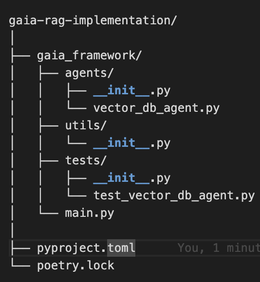

# GAIA RAG Implementation
This repository is for educational purposes to create GAIA. The GAIA framework leverages autonomous agents to collect, process, and retrieve relevant textual information using vector databases.

## Table of Contents
- [Introduction](#introduction)
- [Dependencies](#dependencies)
- [Installation](#installation)
- [Usage](#usage)
- [Project Structure](#project-structure)
- [Contributing](#contributing)
- [Branching Strategy](#branching-strategy)
- [License](#license)

## Introduction

The Generative Agent Integration Architecture (GAIA) is a framework designed to solve user problems using generative AI. This implementation focuses on the Retrieval-Augmented Generation (RAG) component of GAIA. The framework consists of autonomous agents that perform various tasks such as data collection, embedding generation, vector database creation, and retrieval-based text generation.

## Dependencies

The project uses the following dependencies:

- [Python 3.8+](https://www.python.org/downloads/)
- [Transformers](https://github.com/huggingface/transformers)
- [Torch](https://pytorch.org/)
- [FAISS](https://github.com/facebookresearch/faiss)
- [NumPy](https://numpy.org/)
- [Poetry](https://python-poetry.org/)

## Installation

To set up the project, follow these steps:

1. **Clone the repository:**

    ```bash
    git clone https://github.com/yourusername/gaia-rag-implementation.git
    cd gaia-rag-implementation
    ```

2. **Install Poetry:**

    If you don't have Poetry installed, you can install it by following the instructions [here](https://python-poetry.org/docs/#installation).

3. **Install project dependencies:**

    ```bash
    poetry install
    ```

## Usage

To run the project, use the following command:

```bash
poetry run gaia-framework
```
To run tests, use the following command:

```bash
cd gaia_framework
poetry run python -m unittest discover -s /tests
```
To add a package for development
```bash
poetry add --group dev "package-name"
```
Then run 
```bash 
poetry install
```

## Project Structure



- `gaia_framework/agents/`: Contains the implementation of different agents.
- `gaia_framework/utils/`: Utility functions and classes.
- `gaia_framework/tests/`: Unit tests for the project.
- `gaia_framework/main.py`: Main entry point to run the project.

## Contributing
We welcome contributions to enhance the GAIA framework. To contribute, please follow these steps:

If you have an access clone the repo directly.

```bash
git clone https://github.com/SMU-MSCSAI/gaia-rag-implementation.git
```
If not Fork the repo
1. Fork the repository:
  Click on the "Fork" button on the top right corner of this repository page.

2. Clone your forked repository:
```bash
git clone https://github.com/yourusername/gaia-rag-implementation.git
cd gaia-rag-implementation
```

3. Create a new branch for your feature or bugfix:
```bash
git checkout -b feature-or-bugfix-name
```

4. Make your changes:
Make your changes to the codebase.

5. Commit your changes:
```bash
git commit -m "Description of the feature or bugfix"
```

6. Push to your branch:
```bash
git push origin feature-or-bugfix-name
```

7. Open a Pull Request:
Open a Pull Request on the main repository with a description of your changes.

## Branching Strategy
To contribute to this project, please follow the branching strategy:

1. Main Branch:

The main branch contains the stable and released code.

2. Feature Branches:

Create a new branch off the main branch for each feature or bugfix you work on. Use a descriptive name for the branch, such as feature/agent-implementation or bugfix/vector-db.

3. Pull Requests:

Once you have completed your changes, push your feature branch to your forked repository and create a Pull Request against the main branch of the main repository. Ensure your PR includes a detailed description of your changes.

## License

This project is licensed under the MIT License. See the [LICENSE](LICENSE) file for details.


